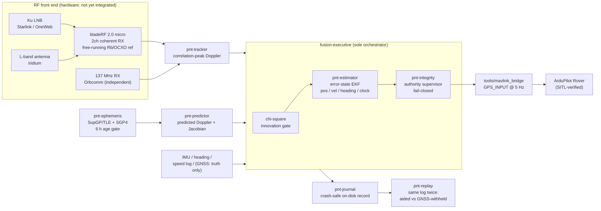

# leo-pnt — GPS-denied maritime navigation from LEO satellite signals

**Can a boat navigate without GPS by listening to satellites that were never meant to help it?**

This repository is a research navigator that answers that question in engineering terms. It
measures Doppler shift on the downlinks of LEO constellations — Starlink, OneWeb, Iridium,
Orbcomm — none of which are navigation systems, and fuses those measurements with a ship's
own inertial, speed-log and heading sensors into a position/velocity/heading solution good
enough to feed an ArduPilot autopilot. No GNSS receiver contributes to the navigation
solution; a free-running rubidium/OCXO frequency reference replaces GPS-disciplined timing
entirely, and the receiver clock is estimated as part of the navigation filter.

Built in Rust (12-crate workspace) + Python (MAVLink/SITL tooling), against a Nuand bladeRF
2.0 micro SDR front end, for a manned displacement-hull test vessel.

> **Safety notice — read first.** This is research software. It is not a navigation product,
> it has never steered a real vessel, and its own safety case forbids it from doing so:
> the steering-authority supervisor is fail-closed and every authority parameter is
> deliberately unfrozen, so the software cannot grant itself steering authority in its
> current state. Nothing here is validated against real RF signals yet. Do not navigate
> with this.

## The idea in one diagram



## Why this is hard (and interesting)

- **LEO Doppler is a velocity instrument, not a position instrument.** Receiver velocity
  shows up in the Doppler measurement immediately; position is only recoverable from how
  the Doppler curve evolves over 10–20 minutes of constant-heading sailing. The whole
  system design — estimator states, test campaign, even the autopilot interface — follows
  from that asymmetry.
- **No GPS time, anywhere.** A GPS-disciplined oscillator would defeat the premise, so the
  frequency reference free-runs and the filter carries receiver clock bias and drift as
  estimated states, plus per-satellite transmit-frequency nuisance states.
- **The research question must not contaminate itself.** A single `gnss_authority` switch
  (`production | recorded_only | off`) routes GNSS to fusion, to a physically separate
  truth journal only, or nowhere — same executable code path in every mode. Headline
  statistics are only ever computed offline from GNSS-withheld runs, scored against the
  truth journal, never against another estimate.
- **It steers a manned boat (eventually).** So authority to steer is a continuously
  re-earned lease: a G1–G4 conjunction (human arm, solution integrity within protection
  limits, calibration validity, watchdog liveness) evaluated in a fail-closed supervisor
  whose output type cannot even represent an autonomous manoeuvre command.

## Headline synthetic result (demonstration, not performance)

From the deterministic end-to-end rehearsal (`mission-study`, seed 1, 180 s, synthetic IQ
through the real tracker → journals → EKF → replay; `.orchestration/DECISIONS.md` D39):

| denied-mode run (same journal) | horiz. position RMS | horiz. speed RMS |
|---|---:|---:|
| dead-reckoning only | 153.1 m | 1.31 m/s |
| + disclosed receiver prior (Doppler suppressed) | 116.1 m | 0.28 m/s |
| + prior + LEO Doppler assimilation | **91.8 m** | 2.19 m/s |
| GNSS-aided reference | 0.83 m | 0.35 m/s |

Two honesty notes baked into the pipeline itself: the receiver prior is disclosed and its
contribution separately attributed (an earlier version of this table conflated it with the
Doppler contribution — adversarial review caught it, and the four-way attribution is now a
tested output); and Doppler assimilation currently *degrades* the velocity solution against
the same-initialization baseline — a known open item under investigation, stated in the
output rather than hidden by baseline choice. All numbers are synthetic-configuration
demonstrations of the wiring, not accuracy claims about real signals.

## Document hierarchy

Documents are ordered by authority. Where two disagree, the higher one wins, and any
document that has been superseded says so in its own text (never only in the successor's
preamble — see failure mode 10 in the handoff).

1. **`docs/design/DESIGN_BASELINE.md`** — normative. The single source of truth for the
   vessel, sensors, rate contract, degradation model and acceptance criteria.
2. **`docs/design/ARCHITECTURE.md`** — subordinate to the baseline. Module boundaries, the
   measurement bus, on-disk formats, time ownership, and the implementation-status addendum
   at its end.
3. **`docs/design/SAFETY_CASE.md`** — subordinate to the baseline. What grants and revokes
   steering authority, and the backstop when the human does not respond.
4. **`docs/design/PARAMS_PROPOSAL.md`** — a proposal, explicitly **PROPOSED — NOT FROZEN**.
   Numeric values for every `AuthorityParams` field with derivations and sensitivity;
   authority may not be granted while any of these remain `[UNVERIFIED]` in the running
   config.
5. **`docs/design/BOM.md`** — bill of materials with EU pricing verified live as of its
   stated access date (**2026-07-22**); prices are `[UNVERIFIED]` for currency beyond that
   date and must be re-checked before purchase.
6. **`docs/research/`** — background research (bladeRF/market, RF-link, regulatory,
   signal-structure). Informative, not normative.
7. **`.orchestration/`** — the review/orchestration record: `PLAN.md` (unit table),
   `DECISIONS.md` (one line per ruling, append-only, never re-litigated), `CONTRACTS.md`
   (bus/API contract versions), `briefs/` (per-unit task briefs) and `reports/` (per-unit
   delivery + review reports). This is the authoritative history of *why* the code looks the
   way it does; consult it before assuming an open question is actually open.

## Crate map

`crates/`:

- **`pnt-types`** — shared, versioned measurement-bus types (envelopes, frames, schema
  version, ENU/ECEF helpers).
- **`pnt-time`** — runtime clock ownership: the sole source of monotonic ordering, freshness
  and deadlines (`ClockService`, `ManualClock`).
- **`pnt-config`** — configuration parsing and the `gnss_authority` policy enum
  (`production | recorded_only | off`); rejects unknown values.
- **`pnt-journal`** — on-disk append-only measurement/truth journals (`FileJournals`), a
  hand-rolled length-delimited little-endian binary codec with CRC-32 per record.
- **`pnt-estimator`** — the error-state EKF: nine-state navigation core, per-pass
  transmit-frequency nuisance biases, and the chi-square (NIS) observation gate.
- **`pnt-integrity`** — solution-integrity and steering-authority supervisor
  (`AuthoritySupervisor`, fail-closed) plus `IntegrityStub`, a fail-open placeholder kept for
  tests/tooling that do not exercise authority logic.
- **`pnt-ephemeris`** — local OMM/TLE (SupGP) storage, age gating, SGP4 propagation, and
  TEME-to-ECEF conversion.
- **`pnt-predictor`** — geometric range-rate and correlation-peak Doppler prediction in ECEF,
  including the linearisation (Jacobian) used by the estimator's Doppler update.
- **`pnt-tracker`** — correlation-peak Doppler measurement from complex baseband IQ (FFT
  search over frequency/delay grid, phase refinement); synthetic-IQ validated only.
- **`pnt-replay`** — deterministic offline replay of a journal run: same measurement stream
  fed to fresh `production` and `recorded_only` executives, truth-scored aided-vs-withheld
  comparison, and optional Doppler-pipeline assimilation for denied-mode replay.
- **`pnt-mission`** — deterministic synthetic full-stack rehearsal: trajectory generator,
  IMU/heading/speed-log/GNSS/Doppler synthesis, `FileJournals` recording, and the
  `mission-study` binary that runs the paired replay study end to end.
- **`fusion-executive`** — the sole runtime orchestrator; owns the event loop, the bus, and
  wires every other crate together through typed ports (no leaf-to-leaf module calls).

`tools/`:

- **`tools/mavlink_bridge`** — Python package that reads one JSON solution record per line on
  stdin and emits MAVLink 2 `GPS_INPUT` (message 232) at 5 Hz, for ArduPilot `GPS1_TYPE=14`.
- **`tools/sitl`** — ArduPilot Rover SITL acceptance harness pinned to a specific
  `Rover-4.6.3` commit; builds SITL, injects a mapped stream through the same bridge code,
  and checks EKF/GPS behaviour, including the recorded characterisation of native ArduPilot
  behaviour on `GPS_INPUT` silence (D17a).

## Running the gates

Rust workspace (from the repo root):

```sh
cargo test
cargo clippy --all-targets -- -D warnings
cargo fmt --all -- --check
```

Python tooling in `tools/mavlink_bridge` and `tools/sitl` uses a project-local virtualenv at
`tools/.venv`. It is not committed to the repository and does not exist in a fresh checkout
— provision it first:

```sh
python3 -m venv tools/.venv
tools/.venv/bin/pip install --upgrade pip
# bridge package + its pinned runtime deps (tools/mavlink_bridge/pyproject.toml:
# pymap3d==3.2.0, pymavlink==2.4.43); DISABLE_MAVNATIVE avoids pymavlink's native-extension
# build, per tools/mavlink_bridge/README.md
DISABLE_MAVNATIVE=1 tools/.venv/bin/pip install -e tools/mavlink_bridge
# SITL waf/build-time deps, pinned in tools/sitl/requirements-build.txt:
# empy==3.3.4, pexpect==4.9.0, dronecan==1.0.27, setuptools==80.10.2
tools/.venv/bin/pip install -r tools/sitl/requirements-build.txt
# test/lint tooling used by the gates below; not pinned anywhere in this tree —
# install recent versions, or pin them yourself for reproducibility
tools/.venv/bin/pip install pytest ruff
```

Once provisioned, these are runnable from a fresh checkout:

```sh
tools/.venv/bin/pytest -q tools/mavlink_bridge
tools/.venv/bin/ruff check tools/mavlink_bridge tools/sitl
```

SITL acceptance additionally requires a built ArduPilot binary — `tools/sitl/build.sh`
clones and builds the pinned `Rover-4.6.3` tree through the same `tools/.venv`, which takes
long enough (full ArduPilot waf build) that it is normally done once per environment, not
per gate run:

```sh
tools/sitl/build.sh   # one-time, long-running; requires tools/.venv provisioned above
tools/sitl/run.sh --duration 45 --speed-mps 0.1 --tolerance-m 10
```

The exact sequence used to provision and validate a working `tools/.venv` is recorded, with
real command transcripts, in the U-M1/U-M1.1 unit worktree (`leo-pnt-wt-UM1`, not part of
this tree) and its logs under `.orchestration/reports/U-M1.1.log`; `.orchestration/reports/U-M1.md`
is the corresponding unit report (there is no `U-M1.1.md` report file — the fix round's
disposition is recorded inside `U-M1.md` itself).

## Running the mission study

`pnt-mission` generates a deterministic synthetic mission (constant-heading legs plus a
coordinated turn, configurable current), journals it exactly as a real capture would be
journalled, then runs `pnt-replay`'s paired aided/denied study on that journal:

```sh
cargo run -p pnt-mission --bin mission-study -- --seed 1 --out /tmp/mission-run
```

The emitted report includes the paired aided/`recorded_only` comparison and a four-way
denied-mode breakdown (`denied_dr_only`, `denied_prior_only`, `denied_prior_with_doppler`,
`denied_no_prior_with_doppler`) that attributes how much of any position improvement comes
from a disclosed receiver prior versus from Doppler assimilation. All numbers are
synthetic-configuration-dependent demonstrations, not performance claims — see
`crates/pnt-mission/README.md` and `.orchestration/DECISIONS.md` D39.

## Status

This is a review-hardened **research skeleton**, validated end to end only on **synthetic**
data, not a sea-ready navigator (ship record: `.orchestration/DECISIONS.md` D27). The fusion
executive, clock service, bus, journals, EKF, ephemeris/predictor, correlation-peak tracker,
authority supervisor, replay/mission harness and MAVLink bridge are all real, connected, and
exercised by an end-to-end synthetic demonstration (`pnt-mission`) and by ArduPilot SITL. The
authority supervisor is fail-closed and safety-case-reviewed (D33); it has not been exercised
against real solution failures at sea.

What remains before a sea trial, per D27 and D39:

- A real-IQ signal path: `pnt-tracker` is synthetic-IQ validated only; real PSS/SSS/beacon
  sequences and real front-end capture are `[UNVERIFIED]`.
- Hardware purchase and integration (bladeRF 2.0 micro, LNB, free-running frequency
  reference, antennas), plus surveyed lever-arm and reference calibration.
- All authority-contract numeric values are **proposed, not frozen**
  (`docs/design/PARAMS_PROPOSAL.md`); the fail-closed gate blocks authority until they are.
- The 24-hour OneWeb channel-occupancy survey gating any OneWeb tracker work.
- Replayed real captures, including the same-log-twice aided-vs-withheld headline result on
  real signals (the mission study is a synthetic rehearsal of this, not a substitute).
- On-vessel confirmation of the SITL-only D17a characterisation of ArduPilot's response to
  `GPS_INPUT` silence, a SITL-proven Case-A hand-to-helm recipe, and a kill-cord wiring test.

## Review and orchestration discipline

`.orchestration/` records the process that produced this repo: `PLAN.md` for the unit table
and status, `DECISIONS.md` for load-bearing rulings (one line each, append-only), and
`briefs/` / `reports/` for the per-unit work and its dual review. Consult it before treating
any open item above as unexamined — most have a specific decision number.

## How this was built

The repo was produced by a multi-model orchestration: units of work were specified in
written briefs, implemented by one model, and then **adversarially reviewed by two
independent non-author models** (with fix rounds gated on re-verification) before any
merge to `main`. Reviews were empirical, not rhetorical — reviewers ran the gates, probed
edge cases with their own harnesses, Monte-Carlo'd the DSP, fault-injected the tests, and
re-derived the math. Several review rounds caught real, subtle defects before they could
ship: a steering-authority latch bypass, a covariance test that passed with process noise
deleted, a MAVLink yaw sentinel that the pinned ArduPilot would have parsed as a phantom
295° heading, an HDOP choice that silently made EKF aiding impossible, and the
prior-confounded headline table above. The complete audit trail — every ruling, every
review verdict, every fix disposition — lives in `.orchestration/DECISIONS.md` (D1–D41)
and `.orchestration/reports/`.

## License

No license has been chosen yet; all rights reserved by default. Open an issue if you want
to build on this and a license decision will be made.

## Origin

The project implements `docs/HANDOFF_PROMPT_BLADERF.md` — a detailed engineering brief
distilled from a prior attempt, including the ten specific failure modes that attempt hit
and this build was structured to avoid. Reading that document first is the fastest way to
understand why the repo is shaped the way it is.
